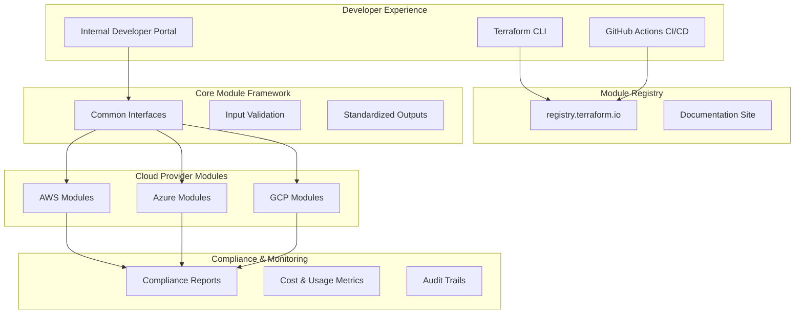

# Multi-Cloud Terraform Modules Design Document

## Overview

The Brockhoff Cloud Terraform module suite provides a unified, cost-effective approach to multi-cloud infrastructure deployment across AWS, Azure, and GCP. The design emphasizes consistency, security, cost optimization, and ease of use for teams with varying levels of cloud expertise. All modules follow well-architected framework principles and support self-service provisioning through developer portals while providing comprehensive compliance and audit capabilities.

## Architecture

### High-Level Architecture



### Module Hierarchy

The module suite follows a three-tier architecture:

1. **Foundation Modules**: Core infrastructure components (networking, security, identity)
2. **Service Modules**: Application-specific services (compute, storage, databases)
3. **Composite Modules**: Complete solutions combining multiple foundation and service modules

### Cross-Cloud Abstraction Strategy

Rather than creating a single abstraction layer, the design uses:
- **Consistent Interfaces**: Common variable names and output structures
- **Provider-Specific Implementations**: Optimized for each cloud's strengths
- **Shared Design Patterns**: Common approaches to security, monitoring, and cost optimization

## Components and Interfaces

### Core Module Structure

Each module follows the existing Brockhoff Cloud template structure with multi-cloud extensions:

```
module-name/
├── main.tf                 # Primary resource definitions
├── variables.tf            # Input variables with validation (following template)
├── outputs.tf             # Standardized outputs (following template)
├── versions.tf            # Provider version constraints
├── locals.tf              # Local value computations (following template)
├── data.tf                # Data source definitions
├── dependencies.tf        # External dependencies
├── kms.tf                 # KMS key resources (following template)
├── alarms.tf              # CloudWatch/monitoring alarms (following template)
├── pricing.tf             # Cost estimation logic (following template)
├── README.md              # Usage documentation
├── CHANGELOG.md           # Version history
├── LICENSE                # ASL2 license
├── Makefile               # Build and test automation (following template)
├── .terraform-docs.yml    # Documentation generation config
├── .tflint.hcl           # Terraform linting config
├── .github/               # GitHub Actions workflows
│   └── workflows/
│       ├── ci.yml
│       ├── release.yml
│       └── security.yml
├── examples/              # Usage examples
│   ├── basic/
│   ├── advanced/
│   └── multi-cloud/
├── modules/               # Sub-modules
│   ├── pricing/          # Cost estimation submodule
│   └── deployer/         # IAM policy for deployment permissions
├── test/                  # Fast unit tests using terraform plan
│   └── plan_test.go      # Tests that run terraform plan on all examples
├── templates/             # Template files
├── compliance/            # Compliance mappings
│   ├── aws-waf.yaml
│   ├── azure-waf.yaml
│   └── gcp-caf.yaml
└── ai-metadata.yaml       # AI agent integration metadata
```

### Standardized Variable Interface

All modules implement the existing Brockhoff Cloud variable patterns, leveraging the terraform-external-context module:

```hcl
# Core variables following existing template
variable "enabled" {
  description = "Set to false to prevent the module from creating any resources"
  type        = bool
  default     = true
}

variable "name_prefix" {
  description = "Organization unique prefix to use for resource names. Generated by terraform-external-context module."
  type        = string
  validation {
    condition     = can(regex("^[a-z][a-z0-9-]{0,22}[a-z0-9]$", var.name_prefix))
    error_message = "The name_prefix value must start with a lowercase letter, followed by 0 to 22 alphanumeric or hyphen characters, ending with alphanumeric, for a total length of 2 to 24 characters."
  }
}

variable "tags" {
  description = "Tags/labels to apply to all resources (generated by terraform-external-context)"
  type        = map(string)
  default     = {}
}

variable "data_tags" {
  description = "Additional tags to apply specifically to data storage resources beyond the common tags"
  type        = map(string)
  default     = {}
}

variable "environment_type" {
  description = "Environment type for resource configuration defaults"
  type        = string
  default     = "Development"
  validation {
    condition = contains([
      "None", "Ephemeral", "Development", "Testing", "UAT", "Production", "MissionCritical"
    ], var.environment_type)
    error_message = "Environment type must be one of: None, Ephemeral, Development, Testing, UAT, Production, MissionCritical."
  }
}

# Standard configuration objects following existing patterns
variable "encryption_config" {
  description = "Configuration object for encryption settings and KMS key management"
  type = object({
    create_kms_key               = bool
    kms_key_id                   = string
    kms_key_deletion_window_days = number
  })
  default = {
    create_kms_key               = true
    kms_key_id                   = ""
    kms_key_deletion_window_days = 14
  }
}

variable "monitoring_config" {
  description = "Configuration object for optional monitoring"
  type = object({
    enabled = bool
  })
  default = {
    enabled = false
  }
}

variable "alarms_config" {
  description = "Configuration object for metric alarms and notifications"
  type = object({
    enabled          = bool
    create_sns_topic = bool
    sns_topic_arn    = string
  })
  default = {
    enabled          = false
    create_sns_topic = true
    sns_topic_arn    = ""
  }
}
```

### Standardized Output Interface

All modules provide consistent outputs following existing patterns:

```hcl
# Primary resource outputs (module-specific)
output "resource_id" {
  description = "Primary resource identifier"
  value       = local.resource_id
}

output "resource_arn" {
  description = "Resource ARN/URI/ID depending on cloud provider"
  value       = local.resource_arn
}

# Standard encryption outputs
output "kms_key_id" {
  description = "ID of the KMS key used for encryption"
  value       = var.enabled && var.encryption_config.create_kms_key ? aws_kms_key.main[0].key_id : ""
}

output "kms_key_arn" {
  description = "ARN of the KMS key used for encryption"
  value       = local.kms_key_id
}

# Standard monitoring outputs
output "alarm_sns_topic_arn" {
  description = "ARN of the SNS topic used for alarm notifications"
  value       = local.alarm_sns_topic_arn
}

# Standard cost estimation outputs
output "monthly_cost_estimate" {
  description = "Estimated monthly cost in USD for module resources"
  value       = module.pricing.monthly_cost_estimate
}

output "cost_breakdown" {
  description = "Detailed breakdown of monthly costs by service"
  value       = module.pricing.cost_breakdown
}

# Compliance and governance outputs
output "compliance_report" {
  description = "Well-architected framework compliance assessment"
  value       = local.compliance_report
  sensitive   = false
}

output "governance_metadata" {
  description = "Governance and audit metadata"
  value = {
    module_name    = local.module_name
    module_version = local.module_version
    environment_type = var.environment_type
    created_date   = timestamp()
  }
}
```

### Self-Service Portal Integration

Modules include portal-specific metadata:

```yaml
# portal-config.yaml
portal:
  category: "compute"
  difficulty: "beginner"
  estimated_cost: "low"
  deployment_time: "5-10 minutes"
  prerequisites: []
  form_schema:
    - name: "instance_type"
      type: "select"
      options: ["small", "medium", "large"]
      default: "small"
      help: "Choose based on expected workload"
```

### AI Agent Integration

Modules include comprehensive machine-readable metadata for AI consumption:

```yaml
# ai-metadata.yaml
ai_agent_support:
  schema_version: "1.0"
  module_type: "compute"
  complexity_level: "intermediate"
  
  generation_templates:
    basic_usage: |
      module "{{ module_name }}" {
        source = "{{ module_source }}"
        
        name         = "{{ resource_name }}"
        environment  = "{{ environment }}"
        instance_type = "{{ instance_type | default('small') }}"
        
        
        {{ key }} = {{ value | terraform_format }}
        
      }
    
  validation_rules:
    - field: "name"
      pattern: "^[a-z0-9-]+$"
      error_message: "Name must contain only lowercase letters, numbers, and hyphens"
    - field: "environment"
      allowed_values: ["dev", "staging", "prod"]
      error_message: "Environment must be dev, staging, or prod"
  
  common_patterns:
    - pattern_name: "web_application"
      description: "Standard web application deployment"
      template_variables:
        instance_type: "medium"
        enable_monitoring: true
        backup_enabled: true
    
  integration_points:
    - module: "networking"
      required_outputs: ["vpc_id", "subnet_ids"]
      connection_type: "dependency"
    - module: "security"
      required_outputs: ["security_group_id"]
      connection_type: "reference"
  
  cost_estimation:
    base_cost_per_hour: 0.05
    scaling_factors:
      instance_type:
        small: 1.0
        medium: 2.0
        large: 4.0
    
  testing_scenarios:
    - name: "basic_deployment"
      variables:
        name: "test-instance"
        environment: "dev"
      expected_resources: 3
    - name: "production_deployment"
      variables:
        name: "prod-app"
        environment: "prod"
        instance_type: "large"
      expected_resources: 5

## Data Models

### Resource Naming and Context Integration

All modules leverage the terraform-external-context module for consistent naming and tagging:

```hcl
# Context module integration (required in all modules)
module "context" {
  source = "kbrockhoff/external-context/terraform"
  
  # Context passed from parent or set directly
  context = var.context
  
  # Override specific values if needed
  name         = var.name
  environment  = var.environment
  cloud_provider = "aws" # or "az", "gcp"
}

locals {
  # Use context-generated name_prefix and tags
  name_prefix = module.context.name_prefix
  tags        = module.context.tags
  data_tags   = module.context.data_tags
  
  # Environment-specific configuration following existing patterns
  environment_defaults = {
    None = {
      rpo_hours                    = null
      rto_hours                    = null
      monitoring_enabled           = var.monitoring_config.enabled
      alarms_enabled               = var.alarms_config.enabled
      kms_key_deletion_window_days = var.encryption_config.kms_key_deletion_window_days
    }
    Ephemeral = {
      rpo_hours                    = null
      rto_hours                    = 48
      monitoring_enabled           = false
      alarms_enabled               = false
      kms_key_deletion_window_days = 7
    }
    Development = {
      rpo_hours                    = 24
      rto_hours                    = 48
      monitoring_enabled           = false
      alarms_enabled               = false
      kms_key_deletion_window_days = 7
    }
    Production = {
      rpo_hours                    = 1
      rto_hours                    = 4
      monitoring_enabled           = true
      alarms_enabled               = true
      kms_key_deletion_window_days = 30
    }
    MissionCritical = {
      rpo_hours                    = 0.083 # 5 minutes
      rto_hours                    = 1
      monitoring_enabled           = true
      alarms_enabled               = true
      kms_key_deletion_window_days = 30
    }
  }
  
  effective_config = var.environment_type == "None" ? (
    local.environment_defaults.None
  ) : (
    local.environment_defaults[var.environment_type]
  )
  
  # Common tags including module metadata
  common_tags = merge(local.tags, {
    ModuleName    = "kbrockhoff/${local.module_name}/${local.cloud_provider}"
    ModuleVersion = local.module_version
    ModuleEnvType = var.environment_type
  })
  
  common_data_tags = merge(local.common_tags, local.data_tags)
}
```

### Compliance Mapping Model

```yaml
# compliance/aws-waf.yaml
well_architected_pillars:
  operational_excellence:
    - control: "OPS01"
      implementation: "CloudWatch monitoring enabled"
      evidence: "module.monitoring.cloudwatch_dashboard_url"
  security:
    - control: "SEC02"
      implementation: "Encryption at rest and in transit"
      evidence: "aws_s3_bucket.main.server_side_encryption_configuration"
  reliability:
    - control: "REL03"
      implementation: "Multi-AZ deployment"
      evidence: "aws_instance.main[*].availability_zone"
  performance:
    - control: "PERF01"
      implementation: "Auto-scaling enabled"
      evidence: "aws_autoscaling_group.main.arn"
  cost_optimization:
    - control: "COST02"
      implementation: "Reserved instance recommendations"
      evidence: "local.cost_optimization_report"
```

### Cost Optimization Model

```hcl
locals {
  cost_optimization = {
    instance_recommendations = {
      current_type = var.instance_type
      recommended_type = data.aws_ec2_instance_type_offering.recommended.instance_type
      potential_savings = "${local.estimated_savings}%"
    }
    
    scheduling_recommendations = var.environment == "dev" ? {
      shutdown_schedule = "weekends"
      estimated_savings = "30%"
    } : null
    
    rightsizing_analysis = {
      cpu_utilization_threshold = 80
      memory_utilization_threshold = 80
      recommendation_confidence = "high"
    }
  }
}
```

## Error Handling

### Validation Strategy

1. **Input Validation**: Comprehensive variable validation with clear error messages
2. **Pre-condition Checks**: Validate cloud provider quotas and permissions
3. **Resource Validation**: Check for naming conflicts and resource limits
4. **Post-deployment Validation**: Verify resource health and connectivity

### Error Response Format

```hcl
# Standardized error handling
locals {
  validation_errors = [
    for error in local.detected_errors : {
      code = error.code
      message = error.message
      severity = error.severity
      remediation = error.suggested_fix
    }
  ]
}

# Example validation
validation {
  condition = var.instance_count <= data.aws_service_quotas_service_quota.ec2_instances.value
  error_message = <<-EOT
    Requested instance count (${var.instance_count}) exceeds AWS quota limit (${data.aws_service_quotas_service_quota.ec2_instances.value}).
    
    Remediation options:
    1. Reduce instance_count to ${data.aws_service_quotas_service_quota.ec2_instances.value}
    2. Request quota increase through AWS Support
    3. Deploy across multiple regions
  EOT
}
```

### Graceful Degradation

Modules implement fallback strategies:
- Alternative instance types when preferred types are unavailable
- Cross-region failover for critical resources
- Reduced feature sets for cost-constrained deployments

## Testing Strategy

### Simplified Testing Approach

Fast unit tests that validate module syntax and configuration by running `terraform plan` on all examples:

1. **Plan Tests**: Validate Terraform syntax and configuration for all examples
2. **Compliance Validation**: Automated well-architected framework validation
3. **Cost Validation**: Budget impact analysis and optimization verification

### Test Structure

```
test/
└── plan_test.go           # Single test file that runs terraform plan on all examples
```

### Test Implementation

```go
// plan_test.go
package test

import (
    "testing"
    "path/filepath"
    "github.com/gruntwork-io/terratest/modules/terraform"
    "github.com/stretchr/testify/assert"
)

func TestTerraformPlanExamples(t *testing.T) {
    examples := []string{"basic", "advanced", "multi-cloud"}
    
    for _, example := range examples {
        t.Run(example, func(t *testing.T) {
            exampleDir := filepath.Join("../examples", example)
            
            terraformOptions := &terraform.Options{
                TerraformDir: exampleDir,
                PlanFilePath: filepath.Join(exampleDir, "plan.out"),
            }
            
            // Run terraform init and plan
            terraform.Init(t, terraformOptions)
            terraform.Plan(t, terraformOptions)
            
            // Validate plan was successful (no errors means test passes)
            assert.True(t, true, "Terraform plan completed successfully for %s example", example)
        })
    }
}
```

### Makefile Integration

The existing Makefile from the terraform-module template provides standardized commands that reduce LLM token usage by simplifying common operations:

```makefile
# Key targets from existing template
.PHONY: help init plan test docs lint clean

help:           ## Show this help
init:           ## Initialize terraform and download dependencies  
plan:           ## Run terraform plan on all examples
test:           ## Run all tests including plan validation
docs:           ## Generate documentation using terraform-docs
lint:           ## Run terraform linting and validation
clean:          ## Clean up temporary files and .terraform directories
```

This allows AI agents and developers to use simple commands like `make test` instead of complex terraform and testing commands, reducing the cognitive load and token usage for LLMs generating infrastructure code.

### Continuous Testing Pipeline

```yaml
# .github/workflows/test.yml
name: Module Testing
on: [push, pull_request]

jobs:
  validate:
    runs-on: ubuntu-latest
    strategy:
      matrix:
        cloud: [aws, azure, gcp]
    steps:
      - name: Terraform Validate
      - name: Security Scan
      - name: Cost Analysis
      - name: Compliance Check
  
  test:
    needs: validate
    runs-on: ubuntu-latest
    steps:
      - name: Unit Tests
      - name: Integration Tests
      - name: Cleanup
```

### Portal Integration Testing

Automated tests verify developer portal integration:
- Form schema validation
- Parameter mapping accuracy
- Deployment success rates
- User experience metrics

### AI Agent Testing

Specialized tests ensure AI agent compatibility:
- Schema validation for machine-readable metadata
- Template generation accuracy
- Pattern recognition and application
- Automated code generation validation
- Integration point verification

```go
// Example AI agent test
func TestAIAgentIntegration(t *testing.T) {
    // Load AI metadata
    metadata := loadAIMetadata("ai-metadata.yaml")
    
    // Test template generation
    template := metadata.GenerationTemplates["basic_usage"]
    generated := renderTemplate(template, testVariables)
    
    // Validate generated Terraform
    assert.True(t, isValidTerraform(generated))
    assert.Contains(t, generated, "module \"test-instance\"")
    
    // Test validation rules
    for _, rule := range metadata.ValidationRules {
        assert.True(t, validateRule(rule, testVariables))
    }
}
```

This design provides a robust foundation for the multi-cloud Terraform module suite, ensuring consistency, security, cost-effectiveness, and ease of use across all three cloud providers while supporting both experienced and novice users through comprehensive documentation and self-service capabilities. The architecture specifically enables AI agents to effectively generate and consume Terraform modules through structured metadata, templates, and validation frameworks.