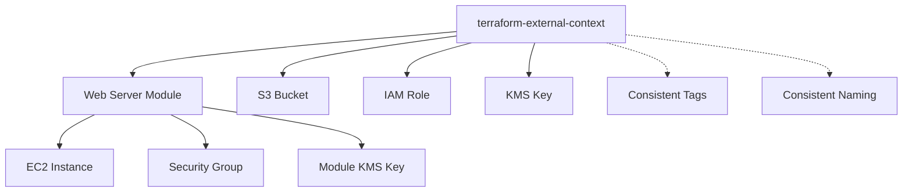

# Basic Context Integration Example

This example demonstrates the fundamental integration of the `terraform-external-context` module with Brockhoff Cloud Terraform modules. It shows how to achieve consistent naming, tagging, and configuration across resources.

## What This Example Demonstrates

- ✅ Basic context module integration
- ✅ Consistent resource naming using context-generated prefixes
- ✅ Standardized tagging across all resources
- ✅ Environment-specific configuration patterns
- ✅ Context variable passing to child modules
- ✅ Cloud provider detection and constraints
- ✅ KMS key management with context integration

## Architecture



## Resources Created

When you run this example, it creates:

1. **Context Module**: Generates consistent naming and tagging
2. **Web Server Module** (via local example module):
   - EC2 instance with context-based naming
   - Security group with appropriate rules
   - KMS key for encryption (if enabled)
   - CloudWatch monitoring (if enabled)
3. **Direct Resources**:
   - S3 bucket with globally unique name
   - IAM role with context-based naming
   - KMS key with alias

## Prerequisites

- [Terraform](https://www.terraform.io/downloads.html) >= 1.5.0
- [AWS CLI](https://aws.amazon.com/cli/) configured with appropriate credentials
- AWS account with permissions to create EC2, S3, IAM, and KMS resources

## Usage

### 1. Clone and Navigate

```bash
git clone <repository-url>
cd examples/context-integration/basic-usage/
```

### 2. Configure Variables

```bash
# Copy the example variables file
cp terraform.tfvars.example terraform.tfvars

# Edit the variables file with your values
nano terraform.tfvars
```

### 3. Initialize and Plan

```bash
# Initialize Terraform
terraform init

# Review the execution plan
terraform plan
```

### 4. Apply Configuration

```bash
# Apply the configuration
terraform apply

# Review the outputs
terraform output
```

### 5. Clean Up

```bash
# Destroy resources when done
terraform destroy
```

## Key Configuration Options

### Context Configuration

```hcl
# Basic context setup
namespace   = "myorg"        # Your organization
environment = "dev"          # Environment name
name        = "webapp"       # Application name

tags = {
  Project    = "WebApp"
  Owner      = "DevTeam"
  CostCenter = "Engineering"
}
```

### Environment Types

Choose the appropriate environment type for automatic configuration:

- **Development**: Cost-optimized, minimal monitoring
- **Testing**: Balanced configuration with basic monitoring
- **UAT**: Production-like with full monitoring
- **Production**: Full monitoring, backups, and security
- **MissionCritical**: Maximum reliability and monitoring

### Cost Optimization

For development environments:
```hcl
environment_type = "Development"
instance_type = "t3.micro"
enable_monitoring = false
enable_alarms = false
```

For production environments:
```hcl
environment_type = "Production"
instance_type = "t3.medium"
enable_monitoring = true
enable_alarms = true
```

## Expected Outputs

After applying, you'll see outputs like:

```
context_name_prefix = "myorg-dev-webapp"
context_tags = {
  "Environment" = "dev"
  "Name" = "webapp"
  "Namespace" = "myorg"
  "Project" = "WebApp"
  "Owner" = "DevTeam"
}
web_server_instance_id = "i-1234567890abcdef0"
s3_bucket_name = "myorg-dev-webapp-bucket-a1b2c3d4"
iam_role_name = "myorg-dev-webapp-role"
kms_key_id = "12345678-1234-1234-1234-123456789012"
```

## Validation

The example includes validation for:

### Name Validation
- Names follow AWS naming conventions
- Names don't exceed length limits
- Names contain only allowed characters

### Tag Validation
- Tag count doesn't exceed AWS limits (50 tags)
- Tag keys and values meet length requirements
- No reserved AWS tag prefixes are used

### Environment Configuration
- Environment type is valid
- KMS key deletion window is within allowed range

## Troubleshooting

### Common Issues

#### Issue: "Name too long"
```bash
# Solution: Use shorter namespace or name
namespace = "org"     # Instead of "very-long-organization-name"
name = "app"          # Instead of "very-long-application-name"
```

#### Issue: "Invalid characters in name"
```bash
# Solution: Use only allowed characters
name = "web-app"      # Instead of "web_app" or "web.app"
```

#### Issue: "Too many tags"
```bash
# Solution: Reduce the number of additional tags
additional_tags = {
  # Keep only essential tags
  Example = "BasicUsage"
}
```

### Debug Information

Use the debug output to troubleshoot:

```bash
terraform output debug_info
```

This shows:
- Generated name prefix
- Environment type configuration
- Cloud provider detection
- Tag count
- Context module status

## Next Steps

After understanding this basic example:

1. **[Multi-Module Example](../multi-module/)** - Learn context inheritance
2. **[Multi-Cloud Example](../multi-cloud/)** - See cross-cloud consistency
3. **[Environment Overrides](../environment-overrides/)** - Advanced configuration patterns
4. **[Advanced Composition](../advanced-composition/)** - Complex module composition

## Files in This Example

- `main.tf` - Primary Terraform configuration
- `variables.tf` - Input variable definitions
- `outputs.tf` - Output value definitions
- `terraform.tfvars.example` - Example variable values
- `README.md` - This documentation

## Best Practices Demonstrated

1. **Always use context module** for consistent naming and tagging
2. **Pass context to child modules** for inheritance
3. **Use environment_type** for automatic configuration
4. **Validate inputs** with clear error messages
5. **Provide debug outputs** for troubleshooting
6. **Include cost optimization** considerations
7. **Follow cloud provider constraints** for naming and tagging