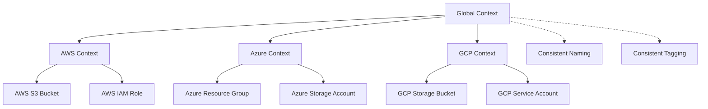

# Multi-Cloud Context Integration Example

This example demonstrates how to use the `terraform-external-context` module consistently across AWS, Azure, and GCP while respecting each cloud provider's specific naming conventions, tagging constraints, and resource requirements.

## What This Example Demonstrates

- ✅ Consistent context across multiple cloud providers
- ✅ Cloud provider-specific naming constraints and validation
- ✅ Tag/label conversion and management across clouds
- ✅ Provider-specific resource naming patterns
- ✅ Cross-cloud compatibility considerations
- ✅ Environment-specific configuration inheritance
- ✅ Validation for multi-cloud deployments

## Architecture



## Cloud Provider Differences Handled

### Naming Conventions

| Provider | Pattern | Max Length | Case Sensitivity | Special Rules |
|----------|---------|------------|------------------|---------------|
| AWS | `^[a-zA-Z][a-zA-Z0-9-]*[a-zA-Z0-9]$` | 63 | Mixed case allowed | S3 buckets globally unique |
| Azure | `^[a-zA-Z][a-zA-Z0-9-_]*[a-zA-Z0-9]$` | 80 | Mixed case allowed | Storage accounts: lowercase, no hyphens |
| GCP | `^[a-z][a-z0-9-]*[a-z0-9]$` | 63 | Lowercase only | Most resources lowercase |

### Tagging/Labeling

| Provider | Name | Max Count | Key Length | Value Length | Special Rules |
|----------|------|-----------|------------|--------------|---------------|
| AWS | Tags | 50 | 128 chars | 256 chars | No `aws:` prefix |
| Azure | Tags | 50 | 512 chars | 256 chars | Case insensitive |
| GCP | Labels | 64 | 63 chars | 63 chars | Lowercase, underscores allowed |

## Resources Created

When enabled, this example creates:

### AWS Resources
- S3 bucket with globally unique name
- IAM role with AWS naming conventions
- All resources tagged with AWS-compatible tags

### Azure Resources
- Resource group with Azure naming conventions
- Storage account with lowercase, no-hyphen naming
- All resources tagged with Azure-compatible tags

### GCP Resources
- Storage bucket with GCP naming conventions
- Service account with GCP naming conventions
- All resources labeled with lowercase GCP labels

## Prerequisites

### Required for All
- [Terraform](https://www.terraform.io/downloads.html) >= 1.5.0

### AWS (if creating AWS resources)
- [AWS CLI](https://aws.amazon.com/cli/) configured
- AWS credentials with permissions for S3, IAM

### Azure (if creating Azure resources)
- [Azure CLI](https://docs.microsoft.com/en-us/cli/azure/) configured
- Azure credentials with permissions for Resource Groups, Storage

### GCP (if creating GCP resources)
- [Google Cloud SDK](https://cloud.google.com/sdk) configured
- GCP project with Storage, IAM APIs enabled
- Service account with appropriate permissions

## Usage

### 1. Clone and Navigate

```bash
git clone <repository-url>
cd examples/context-integration/multi-cloud/
```

### 2. Configure Variables

```bash
# Copy the example variables file
cp terraform.tfvars.example terraform.tfvars

# Edit with your configuration
nano terraform.tfvars
```

### 3. Choose Your Deployment Strategy

#### Option A: AWS Only (Simplest)
```hcl
create_aws_resources = true
create_azure_resources = false
create_gcp_resources = false
```

#### Option B: Multi-Cloud (Requires all credentials)
```hcl
create_aws_resources = true
create_azure_resources = true
create_gcp_resources = true
gcp_project_id = "your-actual-project-id"
```

#### Option C: Validation Only (No resources created)
```hcl
create_aws_resources = false
create_azure_resources = false
create_gcp_resources = false
```

### 4. Initialize and Plan

```bash
# Initialize Terraform
terraform init

# Review the execution plan
terraform plan
```

### 5. Apply Configuration

```bash
# Apply the configuration
terraform apply

# Review the outputs
terraform output
```

### 6. Examine Cross-Cloud Consistency

```bash
# Compare naming across clouds
terraform output naming_comparison

# Compare tagging/labeling
terraform output tagging_comparison

# Check validation results
terraform output validation_results
```

### 7. Clean Up

```bash
# Destroy resources when done
terraform destroy
```

## Key Configuration Patterns

### Global Context Setup

```hcl
# Global context for consistency
module "global_context" {
  source = "kbrockhoff/external-context/terraform"
  
  namespace   = "myorg"     # Keep short (≤10 chars)
  environment = "prod"      # Keep short (≤8 chars)
  name        = "webapp"    # Keep short (≤15 chars)
  
  # Ensure multi-cloud compatibility
  id_length_limit = 50
  regex_replace_chars = "/[^a-zA-Z0-9-]/"
}
```

### Cloud-Specific Context Inheritance

```hcl
# AWS-specific context
module "aws_context" {
  source = "kbrockhoff/external-context/terraform"
  
  context = module.global_context.context
  environment = "${var.environment}-aws"
  
  additional_tag_map = {
    CloudProvider = "AWS"
    Region        = var.aws_region
  }
}

# GCP-specific context (lowercase labels)
module "gcp_context" {
  source = "kbrockhoff/external-context/terraform"
  
  context = module.global_context.context
  environment = "${var.environment}-gcp"
  
  label_key_case   = "lower"
  label_value_case = "lower"
}
```

### Provider-Specific Resource Naming

```hcl
# AWS S3 bucket (globally unique)
resource "aws_s3_bucket" "example" {
  bucket = "${local.aws_name_prefix}-bucket-${random_id.aws_suffix.hex}"
  tags   = local.aws_tags
}

# Azure storage account (lowercase, no hyphens)
resource "azurerm_storage_account" "example" {
  name = lower(replace("${local.azure_name_prefix}sa${random_id.azure_suffix.hex}", "-", ""))
  tags = local.azure_tags
}

# GCP storage bucket (lowercase with hyphens)
resource "google_storage_bucket" "example" {
  name   = "${local.gcp_name_prefix}-bucket-${random_id.gcp_suffix.hex}"
  labels = local.gcp_labels  # Note: labels, not tags
}
```

## Expected Outputs

After applying, you'll see outputs comparing the naming and tagging across clouds:

```
naming_comparison = {
  "global_prefix" = "myorg-dev-webapp"
  "aws_prefix"    = "myorg-dev-aws-webapp"
  "azure_prefix"  = "myorg_dev_azure_webapp"
  "gcp_prefix"    = "myorg-dev-gcp-webapp"
}

tagging_comparison = {
  "aws_tags" = {
    "CloudProvider" = "AWS"
    "Environment"   = "dev-aws"
    "Name"         = "webapp"
    "Namespace"    = "myorg"
    "Project"      = "MultiCloudApp"
    "Region"       = "us-east-1"
  }
  "gcp_labels" = {
    "cloud_provider" = "gcp"
    "environment"    = "dev-gcp"
    "name"          = "webapp"
    "namespace"     = "myorg"
    "project"       = "multicloudapp"
    "region"        = "us-central1"
  }
}
```

## Validation and Constraints

The example includes comprehensive validation:

### Cross-Cloud Validation
- Namespace ≤ 10 characters for compatibility
- Name ≤ 15 characters for compatibility
- Environment ≤ 8 characters for compatibility

### AWS-Specific Validation
- Names match AWS pattern: `^[a-zA-Z][a-zA-Z0-9-]*[a-zA-Z0-9]$`
- Names ≤ 63 characters
- Tags ≤ 50 count
- No reserved `aws:` tag prefixes

### Azure-Specific Validation
- Names match Azure pattern: `^[a-zA-Z][a-zA-Z0-9-_]*[a-zA-Z0-9]$`
- Names ≤ 80 characters
- Storage account names: lowercase, 3-24 chars, alphanumeric only
- Tags ≤ 50 count

### GCP-Specific Validation
- Names match GCP pattern: `^[a-z][a-z0-9-]*[a-z0-9]$`
- Names ≤ 63 characters
- Labels ≤ 64 count
- Label keys/values ≤ 63 characters each

## Troubleshooting

### Common Issues

#### Issue: "Name too long for multi-cloud"
```bash
# Solution: Use shorter components
namespace = "org"      # Instead of "organization"
environment = "prod"   # Instead of "production"
name = "app"          # Instead of "application"
```

#### Issue: "Invalid characters for GCP"
```bash
# Solution: The context module handles this automatically
# But ensure your base names don't have invalid characters
name = "web-app"      # Good
name = "web_app"      # Will be converted to "web-app" for GCP
name = "web.app"      # Will be cleaned up by regex_replace_chars
```

#### Issue: "Storage account name invalid"
```bash
# This is handled automatically by the example
# Azure storage names are automatically converted:
# "my-org-dev-webapp" becomes "myorgdevwebappsa1234"
```

#### Issue: "Provider credentials not configured"
```bash
# Only enable providers you have configured
create_aws_resources = true
create_azure_resources = false  # Disable if no Azure credentials
create_gcp_resources = false    # Disable if no GCP credentials
```

### Debug Information

Use the debug output to understand the configuration:

```bash
terraform output debug_info
```

This shows:
- Which providers are enabled
- Name generation components
- Cloud-specific configurations
- Context module status

### Testing Without Resources

You can test the naming and validation without creating resources:

```bash
# Set all create flags to false
create_aws_resources = false
create_azure_resources = false
create_gcp_resources = false

# Run plan to see naming and validation
terraform plan
```

## Best Practices for Multi-Cloud

1. **Keep names short** - Use abbreviations for namespace, environment, and name
2. **Use consistent tagging** - Define global tags that work across all clouds
3. **Validate early** - Use terraform plan to check naming before applying
4. **Test incrementally** - Start with one cloud, then add others
5. **Document differences** - Keep track of cloud-specific requirements
6. **Use automation** - Let the context module handle conversions
7. **Monitor limits** - Stay within tag/label count limits for each cloud

## Next Steps

After understanding multi-cloud context integration:

1. **[Environment Overrides](../environment-overrides/)** - Learn environment-specific patterns
2. **[Advanced Composition](../advanced-composition/)** - Complex multi-cloud architectures
3. **[Basic Usage](../basic-usage/)** - Return to single-cloud patterns
4. **[Multi-Module](../multi-module/)** - Context inheritance patterns

## Files in This Example

- `main.tf` - Multi-cloud Terraform configuration
- `variables.tf` - Input variable definitions
- `outputs.tf` - Cross-cloud comparison outputs
- `terraform.tfvars.example` - Example variable values
- `README.md` - This documentation